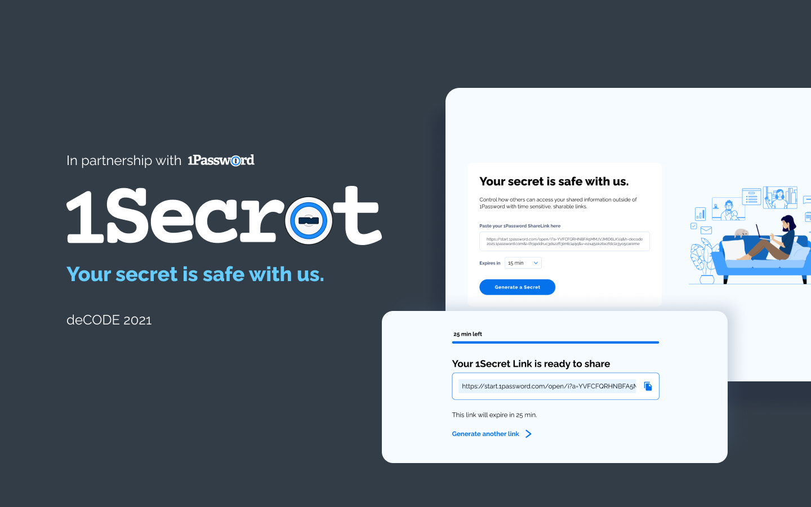
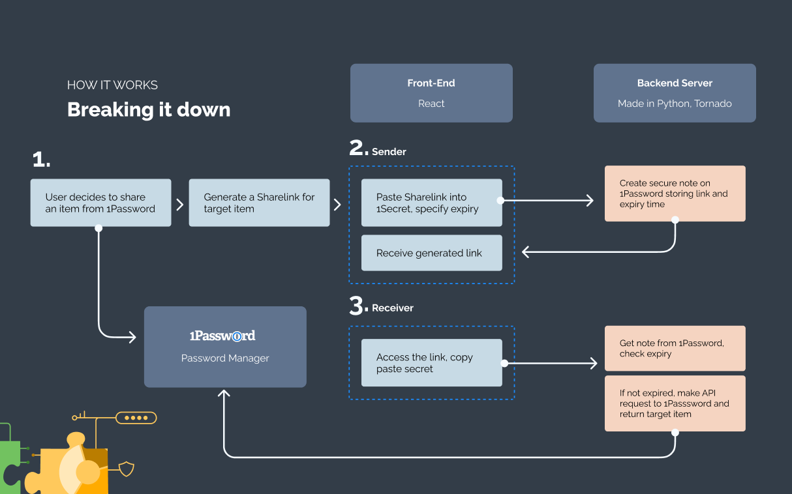
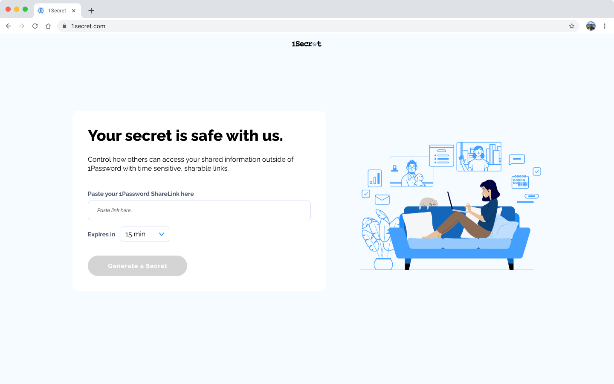
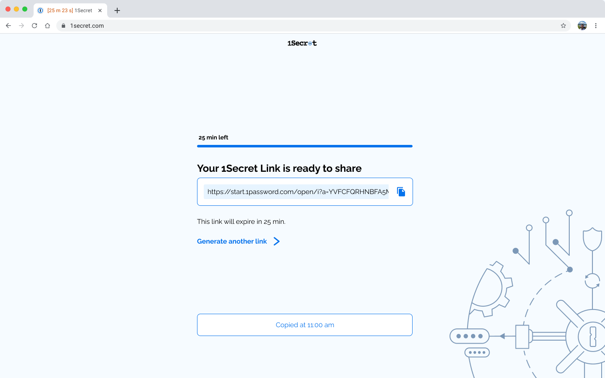
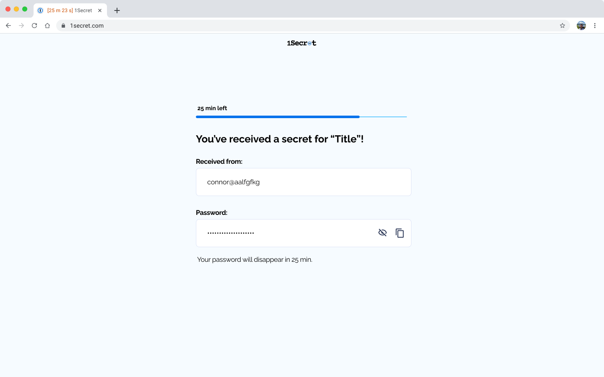

<br />
<p align="center">
  <a href="https://github.com/othneildrew/Best-README-Template">
    
  </a>

  <h3 align="center">Your secret is safe with us.</h3>

  <p align="center">
    deCODE Spring 21' · <a href="">View Demo</a>
  </p>
</p>

<details open="open">
  <summary>Table of Contents</summary>
  <ul>
    <li>
      <a href="#about-the-project">About The Project</a>
      <ul>
        <li><a href="#built-with">Built With</a></li>
      </ul>
    </li>
    <li><a href="#usage">Usage</a></li>
    <li>
      <a href="#getting-started">Getting Started</a>
      <ul>
        <li><a href="#prerequisites">Prerequisites</a></li>
        <li><a href="#installation">Installation</a></li>
      </ul>
    </li>
    <li><a href="#running-the-app">Running the App</a></li>
    <li><a href="#contributors">Contributors</a></li>

  </ul>
</details>

## About The Project



Have you ever felt **anxious** after sending important information for temporary use?

1Secret is a web application that lets you share temporary secret links for passwords and sensitive information. It's like snapchat for secrets.



1Secret feels like a natural extension off of 1Password. It encapsulates the core features of privacy protection, making use of their new release, **1Password Connect**.

### Built With

- [React](https://reactjs.org/)
- [Tornado](https://www.tornadoweb.org/en/stable/)
- [1Password API](https://www.1password.com/)

## Usage

<p float="left">
  
   
</p>


**In a business setting...**
Sharing access tokens with external contractors and partners.

**On a personal level...**
Sending a Netflix password to a friend or sharing a door code with a guest.

This application makes it easy to encrypt the information you want to send though using a timed link

On the receiver side, they will have that time period to copy the information that they need. This ensures the information does not persist over that one time use.

## Getting Started

To get a local copy up and running, follow the below steps.

### Prerequisites

This is an example of how to list things you need to use the software and how to install them.

- npm
  ```sh
  npm install npm@latest -g
  ```
- [pip](https://pip.pypa.io/en/stable/installing/)
- Access to [1Password Connect Python SDK](https://github.com/1Password/connect-sdk-python)

### Installation

Clone the repo:

```sh
git clone https://github.com/winnllam/1Secret.git
```

#### Backend

Follow these steps to set up the Python server:

1. Generate a [GitHub Token](https://github.com/settings/tokens). Make sure to give it 'repo' access. Copy that token that was generated.
2. Head into the correct directory
   ```sh
   cd back
   ```
3. Install the SDK. Replace `TOKEN` with the token generated in step 1.
   ```sh
   pip install https://TOKEN@github.com/1Password/connect-sdk-python/archive/v0.0.1.zip
   ```
4. Grab the access token from the shared 1Password vault. Should look like a whole bunch of letters and numbers.
5. Set the token as an environment variable

   ```sh
   export OP_CONNECT_TOKEN=<TOKEN>

   OR

   set OP_CONNECT_TOKEN=<TOKEN>
   ```

#### Frontend

Install npm packages:

```
npm install
```

## Running the App

#### Backend

From the root folder:

```sh
python3 back/__main__.py

OR

py back/__main__.py
```

#### Frontend

From the root folder:

```sh
cd front
npm run start
```

Make sure to `npm install` if any new packages were added prior to running.

## Contributors

### deCODE Contributors

#### Developers

- Raymond Chen
- Jay Dhulia
- Braden Ganetsky
- Winnie Lam
- Michelle Paradis
- Chris Stojanovski
- Kevin Xu

#### Designers

- Lori Chan
- Ling Lu

### 1Password Mentors

- Connor Hicks
- Jillian Morgan
- Patricia Puno
